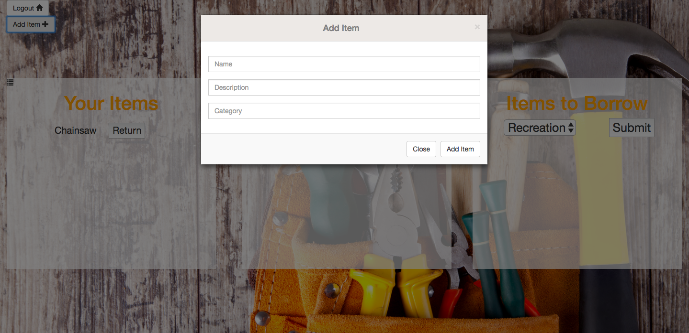

# StuffShare

**Welcome to StuffShare!** This app is all about lending and borrowing items from the community so you don't have to buy expensive things that you have to use only once or twice a year. Need an extension ladder to get on your roof to hang christmas lights? You could spend a couple hundred dollars on one that you use once and then it sits in your already cluttered garage the rest of the year. Or you just login and find one that someone is willing to lend out!  And this app also keeps track of who has your stuff, so you don't have to worry about forgetting who has what.

## Technologies:
- MySQL
- Sequelize
- PassportJS
- Mocha, Chai, Nightmare

## Here's how it works:

#### 1: You log in

#### 2: You can create a new user

#### 3: You are logged into the User Page

#### 4: You can create a new item

#### 5: You can borrow any available item

_This app was created by Max Wang, Matthew Nagy, Dan Weiger, and Jason Kulasingam_